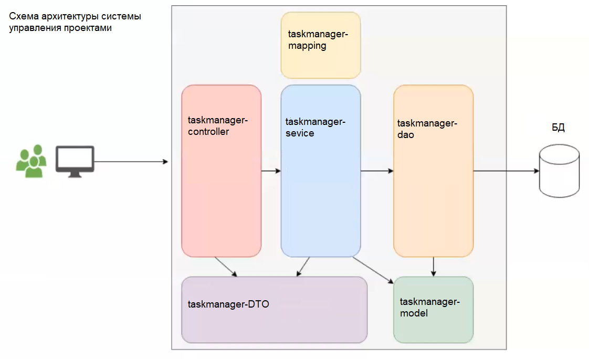

Планируемые модули проекта:
1) web обеспечивает взаимодействие с клиентом
2) service слой бизнес-логики
3) dao DAO, работа с БД
4) dto DTO, обеспечивает передачу информации между слоями
5) mapping обеспечивает взаимодействие модели и DAO
6) model модель бизнес-данных
7) app моудль приложения, обеспечивающий сборку модулей проекта в единое целое. 
Содержит конфигурации и тесты для всех частей проекта.  
Также, в app/src/main/resources/db.changelog/changeset хранятся данные liquibase

схема архитектуры:

Блоки задач по проекту:

1 Создать модель бизнес-данных

2 Описать бизнес-логику

3 Обеспечить взаимодействие модели с БД посредством mapping и DAO  
3.1 Разработать репозиторий, работающий с файловой системой  
3.2 Разработать репозиторий, работающий с БД через JDBC  
3.3 Подключить к проекту Liquibase  
3.3 Разработать Spring-репозитории

4 Разработать DTO и мапперы к ним

5 Написать контроллеры для взаимодействия системы с клиентами

6 Подключить OpenAPI

7 Подключить авторизацию

8 Покрыть проект тестами