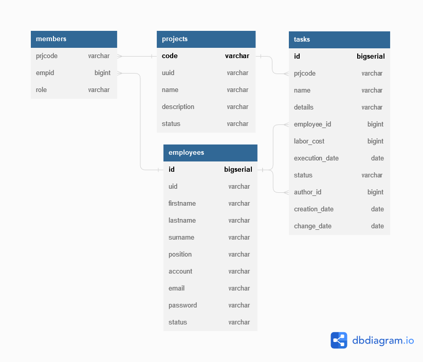

##ER диаграмма:

##Описание схемы данных:

Проект: taskmanagerdb 

Тип СУБД: PostgreSQL

### Список таблиц и полей
Таблица статусов сотрудников:
Table employees_status
* id bigserial [primary key, increment]   Ключевое поле
* emp_status varchar Возможные статусы сотрудника (активный, удаленный)

Таблица сотрудников: Table employees
* id bigserial [primary key, increment]  Ключевое поле
* uid varchar [unique, not null] Здесь и далее - уникальный id, в проекте не задействован
* firstname varchar [not null]   Имя  
* lastname varchar [not null]    Фамилия  
* surname varchar                Отчество  
* position varchar               Должность  
* account varchar                Учетная запись  
* email varchar                  Адрес электронной почты
* password varchar               Пароль
* status varchar [not null]      Статус сотрудника
---

Таблица проектов: Table projects
* code varchar [primary key]        Код проекта
* uid varchar [unique, not null]
* name varchar [not null]           Наименование проекта
* description varchar               Описание проекта
* status varchar [not null]         Статус проекта
---

Таблица команд проекта: table members  

Связывает сотрудников, входящих в команду, с проектом.  
Также, привязывает к сотрудникам их роли в данной команде.
* prjcode varchar [not null]        Ссылка на коды проектов
* empid bigint [not null]           Ссылка на id сотрудников
* role varchar [not null]           Роль в команде

Поля таблицы members имеют следующие связи:  

groups.prj_code > projects.code (many-to-one)  с таблицей проектов  
groups.employee_id > employees.id (many-to-one)   с таблицей сотрудников  
---

Таблица задач: table tasks  

* id bigserial [primary key, increment] Ключевое поле
* uid varchar [unique, not null]
* name varchar [not null]               Наименование задачи
* details varchar                       Описание задачи
* employee_id bigint                    Исполнитель
* labor_cost bigint [not null]          Трудозатраты
* execution_date date [not null]        Крайний срок
* status varchar [not null]             Стауст задачи
* author_id bigint [not null]           Автор задачи
* creation_date date [not null]         Дата создания
* change_date date [not null]           Дата изменения

Поля таблицы Tasks имеют следующие связи:  

tasks.employee_id > employees.id   (many-to-one)  поле "исполнитель" с таблицей сотрудников
tasks.author_id > employees.id     (many-to-one)  поле "автор" с таблицей сотрудников
tasks.prjcode > projects.code      (many-to-one)  полу "проект" с таблицей проектов